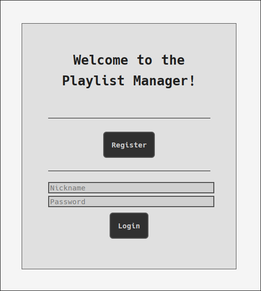

# Web Technologies Project @ PoliMi, 2025

---

<p align="center">
Vlad Raileanu
(<a href="https://github.com/rokuban">@rokuban</a>)
·
Vittorio Robecchi
(<a href="https://github.com/VictuarVi">@victuarvi</a>)
</p>

---

<p align="center">

</p>

</center>

# Usage

To run the project you need to install all the dependencies – which is mostly taken care by Maven – and [configure MariaDB](#mariadb-configuration).

There are already included Tomcat configuration that:

- Test the database connection (according to the default one)
- Build the artifacts
- Deploy the server

There is one for the HTML subproject and one for the RIA[^1].

[^1]: It's called JS for legacy purposes; its folder too.

> [!TIP]
> Look in the [documentation](https://github.com/VictuarVi/tiw-project-2025/blob/be228ebfa36df0d59e146cda67c3a5855a05b385/docs/WT-Project-Documentation.pdf): the process is meticulously described.

## MariaDB configuration

Start MariaDB:

```shell
sudo systemctl start mariadb
```

Then access MariaDB console:

```shell
sudo mariadb
```

and create the database:

```mariadb
CREATE DATABASE db_name;
# add privileges
GRANT ALL PRIVILEGES ON db_name.* TO `user`@'hostname';
exit;
```

> [!NOTE]
> The project assumes the user `tiw@localhost` is accessing the `tiw` database. If needed, change the `src/main/webapp/WEB-INF/web.xml` file in the desidered subproject.

And finally load the SQL file:

```shell
mariadb --user NAME --password < *.sql
```

where `NAME` = user from the step before.

# Tech stack 🖥️

- Java
  - IDE: JetBrains IntelliJ Idea Ultimate Edition ([website](https://www.jetbrains.com/idea/))
  - Java JDK: OpenJDK (`openjdk-24`, [website](https://openjdk.java.net/))
  - Build tool: [Apache Maven](https://maven.apache.org/)
  - Documentation: Javadoc, Jsdoc
- Web development
  - Jakarta Servlet: [Apache Tomcat](https://tomcat.apache.org/)
  - Template engine: [Thymeleaf](https://www.thymeleaf.org/)
  - [Typescript](https://www.typescriptlang.org/)
- Typesetting: [typst](https://typst.app/)
- Diagrams: [draw.io](https://app.diagrams.net/) for ER, [yFiles](https://www.yworks.com/products/yfiles) for UML (integrated in IntelliJ) and [ifml edit](https://editor.ifmledit.org/) for IFML
- DBMS: [MariaDB](https://mariadb.org/)
